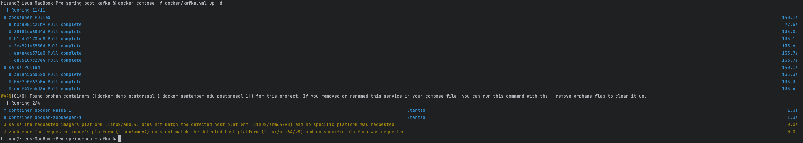
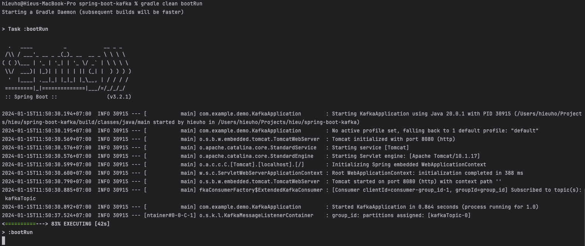
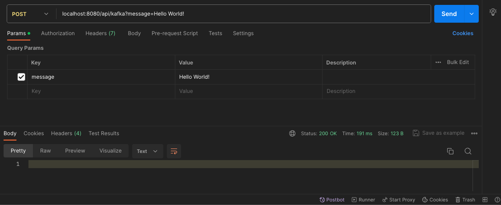
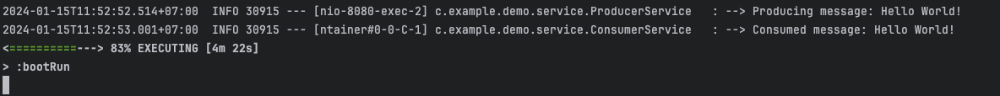
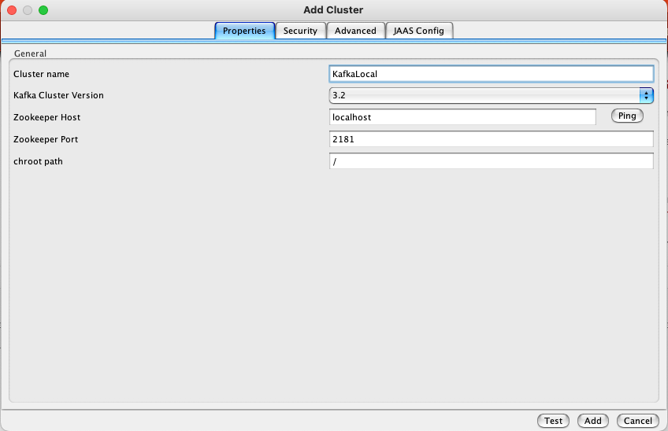
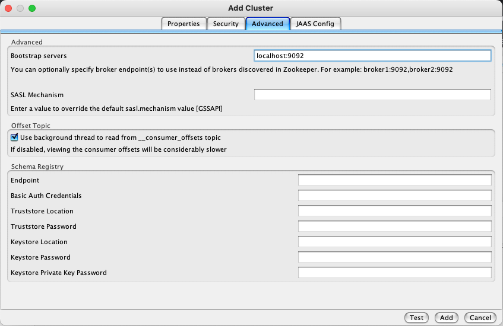
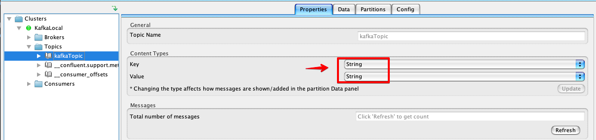
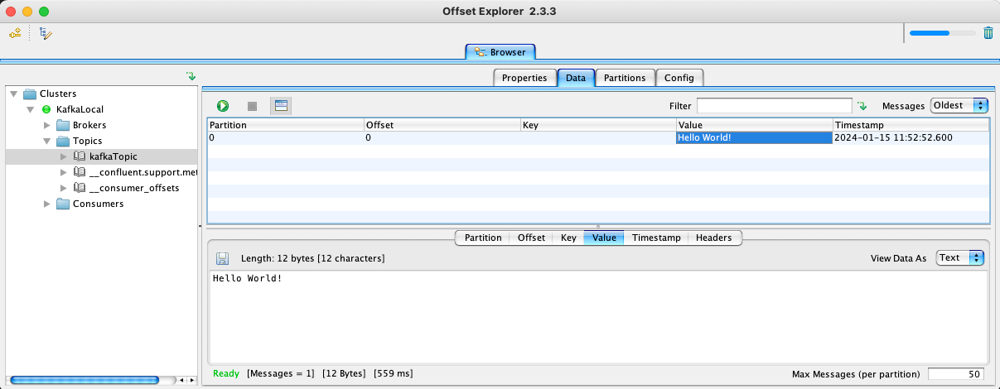

# spring-boot-kafka
This project demonstrates how to use Kafka with Spring Boot 3. Using Docker to set up local Kafka cluster.

## Before we start
Maker sure Docker is installed and running on your machine. Reference: [Docker Desktop](https://www.docker.com/products/docker-desktop/)

### 1. Setup Zookeeper and Kafka locally
1.1. Check Docker compose file in `/docker/kafka.yml` file

1.2. Run Docker command: `docker compose -f docker/kafka.yml up -d` 

1.3. Verify that the Zookeeper and Kafka is running in Docker Desktop:

### 2. Start application and test the Kafka
2.1. Start application: `gradle clean bootRun`

2.2. Publish a message:

We see in the console log:

### 3. Introducing Offset Explorer
Offset Explorer (formerly Kafka Tool) is a GUI application for managing and using Apache Kafka ® clusters. [Download here](https://www.kafkatool.com/download.html)

3.1. Connect to Kafka cluster

Add cluster properties:

**Note**: we need to use **Bootstrap servers property to connect to the Kafka server**: `localhost:9092`

3.2. Browsing the Kafka topics

Config `Content Types`

Browsing the topic messages

